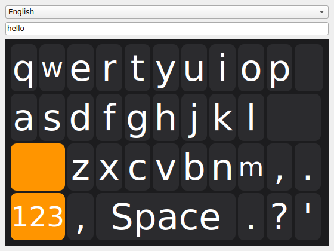
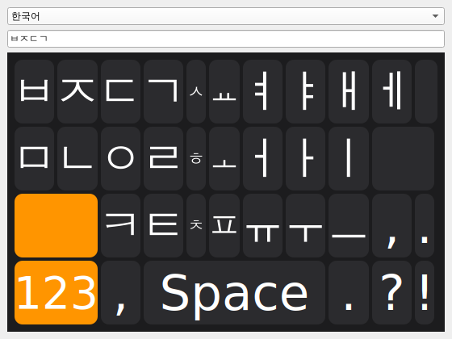
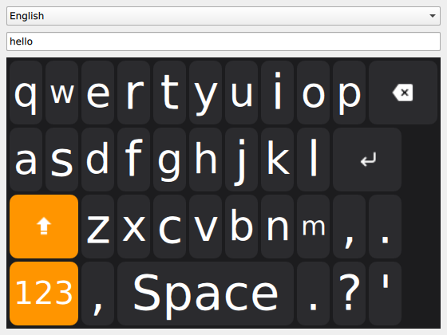
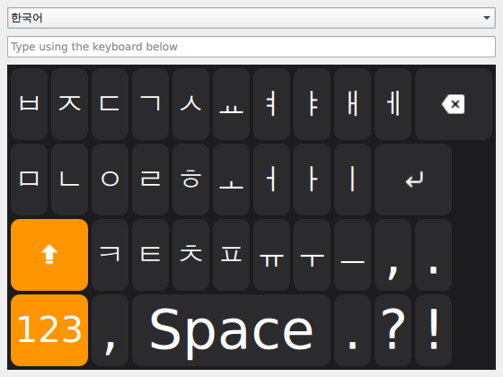

# QKeyboard

[](https://github.com/wruwami/QKeyboard/actions/workflows/ci.yml)
[](https://codecov.io/gh/wruwami/QKeyboard)


> **Notice:** This is a temporary personal project, developed with the
> assistance of AI. Feel free to try it out, but it's still early-stage
> and evolving quickly, so it's not really at the point of being a
> finished "product" yet.

An on-screen keyboard widget for Qt, licensed under Apache-2.0. It supports
both QWidget and QML (Qt Quick) applications from the same core, drives its
key layout entirely from JSON (so adding a language or remapping keys never
requires touching code), and exposes a live theme object for re-skinning at
runtime.

This is an independent, clean-room implementation — see [`NOTICE`](NOTICE)
for details on what that means and how this project relates to other
on-screen keyboard projects.

## Demo

`examples/widgets_example` (QWidget) and `examples/qml_example` (Qt Quick),
both actually built and run (Qt 6.4, Ubuntu 24.04, offscreen X server) — the
combo box switches `resources/layouts/en.json` and `resources/layouts/ko.json` at runtime, and
Shift/Switch keys render in the accent color. Both views render the same
`KeyboardController`/`KeyboardTheme` core, which is why they look identical
key-for-key:

<p>
  
  
</p>
<p>
  
  
</p>

## Features

- **Dual UI**: `KeyboardWidget` (QWidget) and `KeyboardPanel.qml` (Qt Quick)
  both render the same `KeyboardController`/`KeyboardTheme` C++ objects.
- **JSON-driven layouts**: every key is a self-describing object (`type`,
  `text`, `icon`, `target`, `span`); see [Layout format](#layout-format).
- **Theming**: colors, font, corner radius, and spacing are `Q_PROPERTY`s on
  a single `KeyboardTheme` object; change one at runtime and every key
  re-renders.
- **i18n**: per-locale key layouts (`resources/layouts/en.json`,
  `resources/layouts/ko.json`, ...) plus Qt Linguist translation of
  control-key labels (Enter, Backspace, Shift, ...).
- **Hangul composition**: `qkw::HangulComposer` is an opt-in helper that
  turns the jamo `resources/layouts/ko.json` emits one at a time into precomposed
  Hangul syllable blocks; see the note under [Layout format](#layout-format).

## Status

The core library, both views, the CMake build, the `en`/`ko` layouts,
UI-string translation, and the example apps are implemented. Check the
repository's issues for anything still open before assuming this builds out
of the box.

Supports Qt5 (broad 5.x) through the latest Qt6: the QML types are
registered imperatively with `qmlRegisterType()` (see
[Using the QML view](#using-the-qml-view)) rather than the `QML_ELEMENT`
macro, since `QML_ELEMENT` needs Qt 5.15+/Qt6 and this library doesn't
assume that.

## Using the QWidget view

```cpp
#include "qkeyboard/keyboard_widget.h"

auto *keyboard = new qkw::KeyboardWidget(parentWidget);
// Already shows a working English keyboard with a default dark theme - no
// setup required. Only call these to customize away from the defaults:
// keyboard->controller()->setLocale(qkw::KeyboardController::Locale::Korean);
// keyboard->controller()->loadFile("/path/to/custom-layout.json");

// Wire it up to whatever text field you're typing into.
connect(keyboard->controller(), &qkw::KeyboardController::characterEntered,
        this, [this](const QString &text) { lineEdit->insert(text); });
connect(keyboard->controller(), &qkw::KeyboardController::backspaceRequested,
        this, [this]() { lineEdit->backspace(); });
connect(keyboard->controller(), &qkw::KeyboardController::enterRequested,
        this, [this]() { submit(); });

// Optional: re-skin at runtime.
keyboard->theme()->setKeyColor(QColor("#2b2b2e"));
keyboard->theme()->setAccentKeyColor(QColor("#ff9500"));
keyboard->theme()->setCornerRadius(10);
```

## Using the QML view

Register the C++ types once, before loading any QML that imports
`QKeyboard`, and add `qml/` to the import path so the `qmldir` there
(which declares the `KeyboardKey`/`KeyboardPanel` QML components) is found:

```cpp
#include <QQmlApplicationEngine>
#include "qkeyboard/qml_registration.h"

QQmlApplicationEngine engine;
qkw::registerQmlTypes(); // registers KeyboardController and KeyboardTheme
engine.addImportPath(QStringLiteral(":/qkeyboard/qml")); // or wherever qml/ is deployed
engine.load(QUrl(QStringLiteral("qrc:/main.qml")));
```

```qml
import QtQuick 2.0
import QKeyboard 1.0

Item {
    KeyboardController {
        id: controller
        // Already shows English by default - set source or call
        // setLocale(KeyboardController.Korean) only to customize.

        onCharacterEntered: (text) => inputField.insert(inputField.cursorPosition, text)
        onBackspaceRequested: inputField.remove(inputField.cursorPosition - 1, inputField.cursorPosition)
        onEnterRequested: submit()
    }

    KeyboardTheme {
        id: theme
        keyColor: "#2b2b2e"
        accentKeyColor: "#ff9500"
        cornerRadius: 10
    }

    KeyboardPanel {
        anchors.bottom: parent.bottom
        width: parent.width
        controller: controller
        theme: theme
    }
}
```

Requires linking `Qml`/`Quick` (`QKW_ENABLE_QML`, on by default in
`CMakeLists.txt`). `qml/QKeyboard/KeyboardKey.qml` and
`qml/QKeyboard/KeyboardPanel.qml` are shipped as plain files plus a
hand-written `qml/QKeyboard/qmldir` — not a compiled
Qt6-only `qt_add_qml_module` — so the same setup works on Qt5 and Qt6.

## Switching languages at runtime

Two independent things can change per language:

1. **Key layout** — call `controller->setLocale(qkw::KeyboardController::Locale::Korean)`
   (C++) or `controller.setLocale(KeyboardController.Korean)` (QML) to switch
   to one of the layouts bundled with the library (`Locale::English` is the
   default already loaded on construction). For a layout that isn't bundled,
   call `controller->loadFile(...)` (C++) or set `controller.source` (QML)
   with a path to your own `<locale>.json` instead.
2. **UI string translation** (Enter/Backspace/Shift/... labels) — install a
   `QTranslator` loaded from the compiled `qkeyboard_<locale>.qm`
   before switching the layout, so `KeyboardController::resolveLabel()`
   picks up the translated strings on the next `rows` rebuild. English needs
   no translator at all: `QCoreApplication::translate()` falls back to the
   (English) source text when no translator is installed for the active
   locale.

```cpp
auto *translator = new QTranslator(qApp);
// CMAKE_INSTALL_DATADIR/qkeyboard/i18n if installed system-wide, or
// wherever your app embeds/deploys the .qm files it needs.
translator->load(QLocale(QLocale::Korean), QStringLiteral("qkeyboard"),
                  QStringLiteral("_"), QStringLiteral("/usr/share/qkeyboard/i18n"));
qApp->installTranslator(translator);
keyboard->controller()->setLocale(qkw::KeyboardController::Locale::Korean);
```

`resources/i18n/qkeyboard_ko.ts` is the Korean translation source;
`QKW_BUILD_TRANSLATIONS` (on by default) compiles it to `.qm` via CMake at
build time and installs it. To add another language's JSON layout, add
`resources/layouts/<locale>.json` — no code change needed to use it via
`loadFile()`/`source`. To also make it reachable through `setLocale()`,
additionally add a `KeyboardController::Locale` enum value and a case in
`setLocale()`'s mapping (`src/keyboard_controller.cpp`). For UI string
translation, add `resources/i18n/qkeyboard_<locale>.ts` (run
`lupdate` against `src/keyboard_controller.cpp`, context `QKeyboard`,
to seed it with the current source strings), list it in `QKW_TS_FILES` in
`CMakeLists.txt`, and translate it in Qt Linguist.

## Layout format

```jsonc
{
  "locale": "en",
  "pages": [
    {
      "id": "lower",
      "rows": [
        [
          { "type": "char", "text": "q" },
          { "type": "backspace", "span": 2, "icon": ":/qkeyboard/icons/backspace.svg" }
        ],
        [
          { "type": "shift", "target": "upper", "span": 2, "icon": ":/qkeyboard/icons/shift.svg" },
          { "type": "switch", "target": "numeric", "labelId": "numbers", "span": 2 },
          { "type": "space", "span": 5 },
          { "type": "enter", "span": 2, "icon": ":/qkeyboard/icons/enter.svg" }
        ]
      ]
    },
    { "id": "upper", "rows": [ "..." ] }
  ]
}
```

| Field | Meaning |
|---|---|
| `type` | `char`, `backspace`, `enter`, `space`, `shift`, or `switch`. |
| `text` | Literal characters inserted for `char` keys. |
| `labelId` | Translatable id for control-key display text (`enter`, `backspace`, `space`, `shift`, `numbers`, `letters`, `symbols`); falls back to a sane default per action if omitted, except `switch` keys, which must specify it explicitly (there is no single default label for a page-switch key). |
| `icon` | Resource/file path for the key's icon (optional). |
| `target` | Page `id` to jump to, for `shift`/`switch` keys. |
| `span` | Grid column span (default 1). |

Adding a new language is just adding a new `resources/layouts/<locale>.json`
file — no code changes required. See `resources/layouts/en.json` and
`resources/layouts/ko.json` for complete examples.

> **Note on `resources/layouts/ko.json`**: it emits individual Hangul jamo characters
> (ㅂ, ㅏ, ...) one at a time, same as pressing each key on a physical
> 2-beolsik keyboard. Composing them into syllable blocks (e.g. ㄱ+ㅏ+ㄴ →
> 간) is an opt-in step: feed `KeyboardController::characterEntered` /
> `backspaceRequested` through a `qkw::HangulComposer` (see
> `include/qkeyboard/hangul_composer.h` and
> `examples/widgets_example/main.cpp`) before touching your text field. Left
> unwired, jamo are inserted uncomposed and composition falls back to
> whatever the receiving text field / OS IME does with them.

## Examples

`examples/widgets_example` and `examples/qml_example` are both minimal demo
apps: a text field driven entirely by the keyboard, a combo box that swaps
the `en`/`ko` layout at runtime, and a small `KeyboardTheme` override. Build
them with the rest of the project (they're on by default) and run
`qkw_widgets_example` / `qkw_qml_example` from the build directory.

## Testing & CI

```sh
cmake -S . -B build -DQKW_ENABLE_COVERAGE=ON
cmake --build build
ctest --test-dir build --output-on-failure
```

By default `qkeyboard` builds as a static library. Pass the standard
CMake `-DBUILD_SHARED_LIBS=ON` to build it as a shared library instead; the
library exports symbols correctly either way (a `qkw_export.h` header is
generated and installed alongside the rest of `include/qkeyboard`).

`.github/workflows/ci.yml` runs this same build+test on a full matrix of
Linux, Windows, and macOS, each on both Qt 5.15 and Qt 6.7 (the two ends of
the "Qt5 through the latest Qt6" support range) — six jobs on every
push/PR. Coverage (lcov, GCC-only) is collected once, from the
Linux+Qt6 leg, and uploaded to Codecov. To get the Codecov badge actually
reporting data, the repo owner needs to connect `wruwami/QKeyboard` at
[codecov.io](https://codecov.io) and add the resulting upload token as a
`CODECOV_TOKEN` repository secret — that step can't be done from CI itself.
Coverage is scoped to the library itself: [`codecov.yml`](codecov.yml)
excludes `tests/**` and `examples/**` from every Codecov check (mirroring
the `lcov --remove` filter in the CI step above), so example-app or
test-file changes never get flagged for "missing" coverage.

A separate `lint` job runs on every push/PR too:

```sh
# formatting — must produce no diff
find src include tests examples -name '*.cpp' -o -name '*.h' | xargs clang-format --dry-run --Werror

# static analysis
cppcheck --std=c++17 --language=c++ --enable=warning,style,performance,portability \
  --inline-suppr --suppressions-list=.cppcheck-suppressions --error-exitcode=1 -I include \
  src include tests examples
```

Formatting rules live in [`.clang-format`](.clang-format) (matches the
style already used throughout the codebase — 4-space indent, brace
placement, pointer/reference alignment); run `clang-format -i <file>`
locally before committing. cppcheck's suppression list
([`.cppcheck-suppressions`](.cppcheck-suppressions)) is kept to genuine
false positives (e.g. Qt headers/moc output cppcheck can't resolve without
a full Qt install) — see the comments in that file before adding to it.

## Repository layout

```
include/qkeyboard/   public headers (namespace qkw)
src/                       implementation
qml/                       Qt Quick components
resources/                 resources/qkeyboard.qrc + everything it embeds
resources/layouts/         per-locale layout JSON
resources/i18n/            Qt Linguist translation sources
assets/icons/              key icons (SVG)
examples/                  demo apps
```

## Versioning

This project follows [Semantic Versioning](https://semver.org/); see
[`VERSIONING.md`](VERSIONING.md) for the exact rules (the project is
currently pre-1.0, so the public API isn't stable yet) and
[`CHANGELOG.md`](CHANGELOG.md) for what changed in each release.

## License

Apache-2.0 — see [`LICENSE`](LICENSE) and [`NOTICE`](NOTICE).
